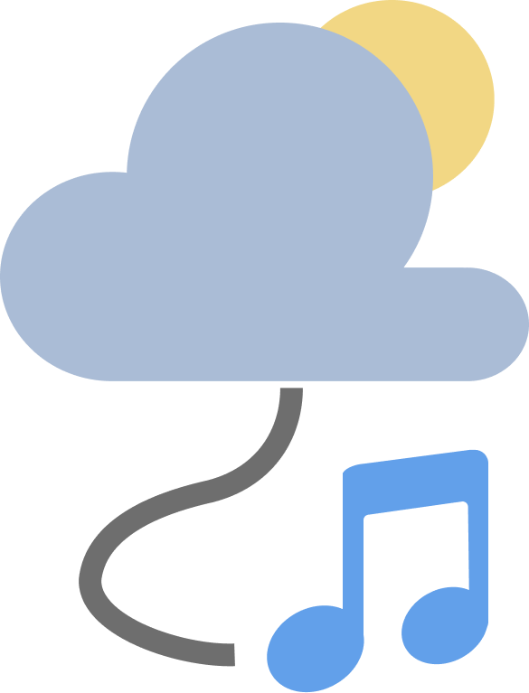
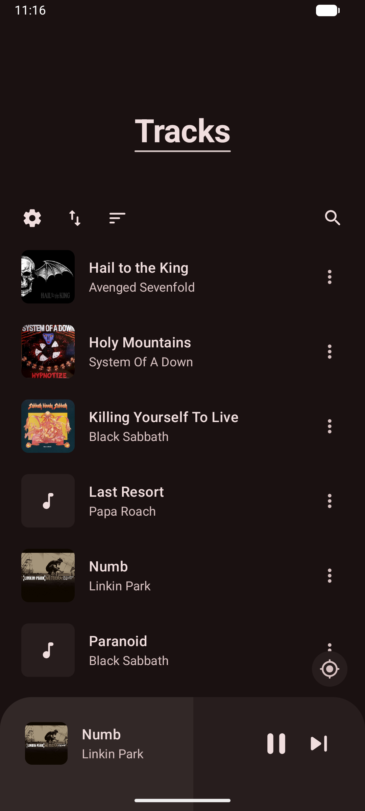
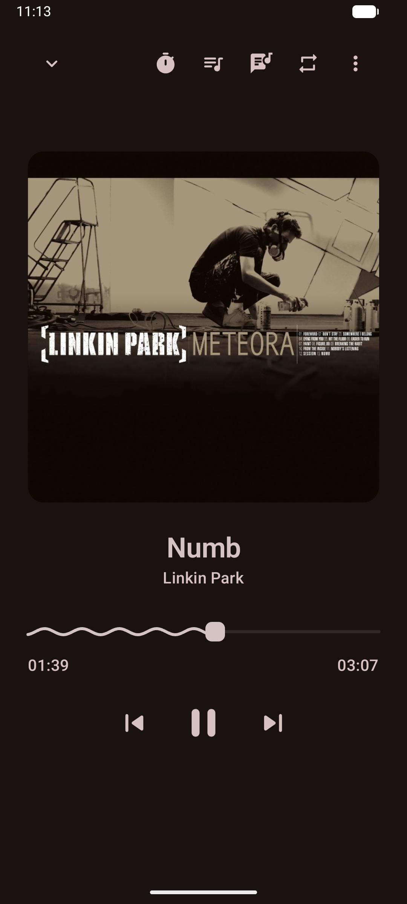
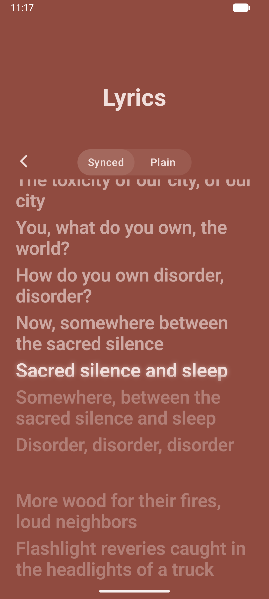
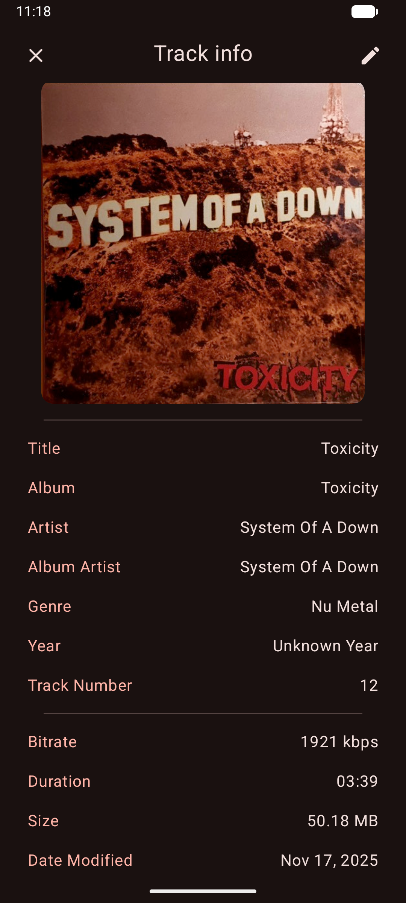
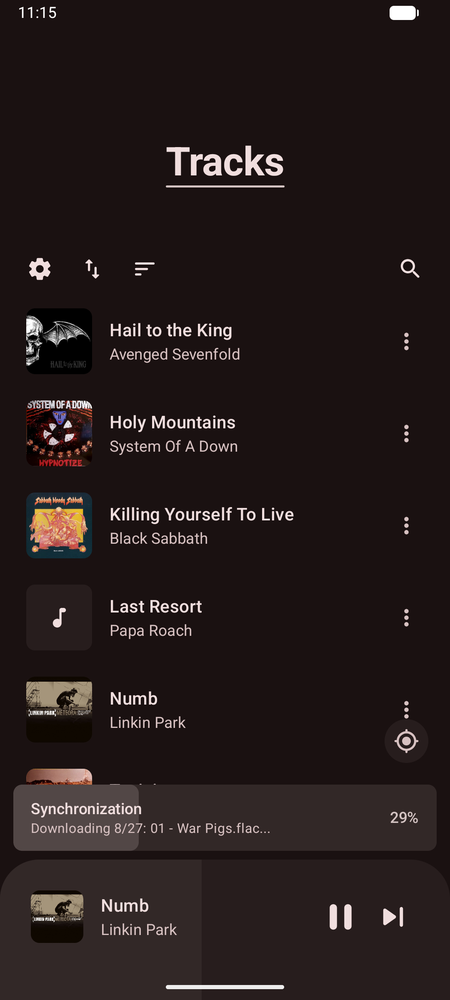
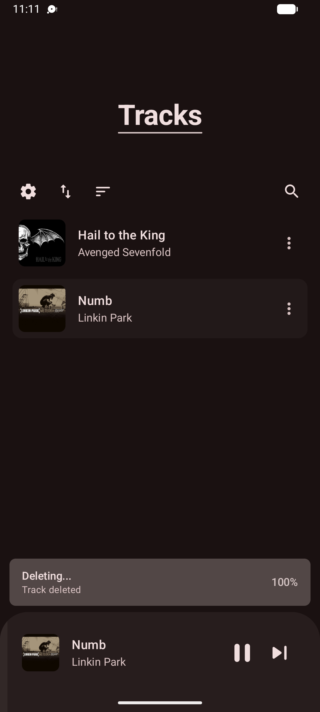
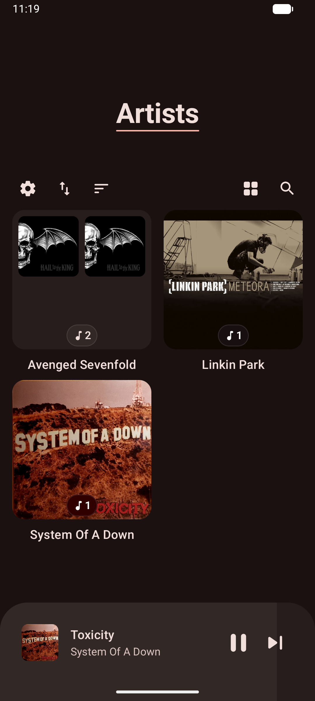

<div align="center">
  

  # Astolfo's Player

  ### Music player for Android designed with Material You
  
</div>

## Screenshots

<div align="center">
  <div>
    
    
    
    
    
    
    
    
  </div>
</div>

## Features
- Enjoy your favorite music in a variety of formats, including MP3, FLAC, OGG, WAV, and more
- Easily browse tracks, albums, artists, and genres, and create custom playlists
- Enhance your listening experience with synchronized lyrics from [LRCLIB](https://lrclib.net/)
- Manually update track details or fetch accurate info from [MusicBrainz](https://musicbrainz.org/)
- Designed with [Material You](https://m3.material.io/) and supports dynamic color palettes
- Sync your library with the [Astolfo's server](https://github.com/datapeice/astolfosplayer-backend)
## Download
Latest stable version is available on [GitHub releases](https://github.com/datapeice/astolfosplayer-android/releases/latest)

## Support
If you enjoy using Astolfo's Player, consider:
- ⭐ Starring the repository on GitHub
- 🐛 Reporting bugs and suggesting features via [Issues](https://github.com/datapeice/astolfosplayer-android/issues)
- 🤝 Contributing to the project

## Build
1. **Get the Source Code**  
   - Clone the repository or download the source code:
     ```bash
     git clone https://github.com/datapeice/astolfosplayer-android.git
     ```

2. **Open project in Android Studio**  
   - Launch Android Studio.  
   - Select **File > Open** and navigate to the project's folder.  
   - Click **OK** to open the project.

3. **Run the project**  
   - Wait for the project to sync and build (Gradle sync may take some time).  
   - Ensure a device or emulator is connected.  
   - Click the **Run** button or press `Shift + F10` to build and launch the app.  

That's it! The app should now be running. 

## Credits
Forked from [Lotus](https://github.com/dn0ne/lotus)

Some UI elements are inspired by [Vanilla](https://github.com/vanilla-music/vanilla)

Lyrics UI is inspired by [Beautiful Lyrics](https://github.com/surfbryce/beautiful-lyrics)

[MaterialKolor](https://github.com/jordond/materialkolor)

[kmpalette](https://github.com/jordond/kmpalette)

[Reorderable](https://github.com/Calvin-LL/Reorderable)

[jaudiotagger](https://bitbucket.org/ijabz/jaudiotagger/src/master/)

## License
Astolfo's Player is licensed under [GPLv3](LICENSE.md)
